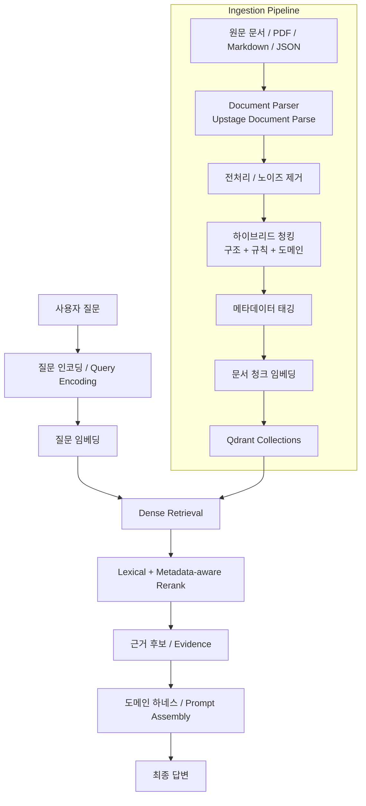

# RAG Guide

> 구조화 문서 기반 하이브리드 청킹부터 Qdrant 검색, 하네스 엔지니어링, 평가/운영까지 정리한 한국어 실전 RAG 가이드.

이 프로젝트는 **RAG(Retrieval-Augmented Generation)** 시스템을 실제로 설계하고 고도화하는 과정을 문서화한 저장소다. 단순한 개념 요약이 아니라, **실제 구현과 개선 과정**을 기준으로 정리했다.

핵심 범위:
- Upstage Document Parse 기반 문서 구조 추출
- 하이브리드 청킹(문서 구조 + 규칙 기반 + 도메인 메타데이터)
- Upstage 임베딩 파이프라인
- Qdrant 컬렉션 설계 및 버전 운영
- Dense retrieval + lexical/metadata-aware reranking
- 도메인 하네스(`saju` 사례)
- 평가셋, 회귀 검증, 운영 전환 전략
- 실제 스크립트와 엔지니어링 아티팩트 설명

---

## 왜 이 저장소를 만들었나

RAG를 공부하다 보면 금방 이런 문제를 만난다.

- 임베딩 모델은 괜찮은데 검색 결과가 이상하다.
- semantic chunking만으로는 표, 목차, 사례 문서를 제대로 다루기 어렵다.
- vector search를 붙였는데 일반론이 반복된다.
- 검색 결과는 나오지만 실제 답변 품질은 기대만큼 오르지 않는다.
- 컬렉션을 갈아엎을 때마다 비교 기준이 사라진다.

이 저장소는 그런 문제를 **데이터 전처리 → 청킹 → 임베딩 → 리트리벌 → 리랭킹 → 하네스 → 검증** 순서로 풀어간 과정을 정리한 문서다.

---

## 이 저장소가 다루는 핵심 질문

- 좋은 RAG는 왜 **청킹 설계**에서 대부분 갈리는가?
- 왜 단순 semantic chunking보다 **document structure-aware chunking**이 더 중요한가?
- 질문도 임베딩하는 dense retrieval 뒤에 왜 **rerank 레이어**가 필요한가?
- 왜 표(table)와 본문(non-table)을 **같은 컬렉션에 섞으면 검색 품질이 흔들리는가?**
- 실제 프로젝트에서 어떻게 **v1 → v2 → v3** 식으로 검색 품질을 개선하는가?
- 왜 retrieval 시스템은 코드만이 아니라 **평가와 운영 전략까지 같이 설계해야 하는가?**

---

## 전체 아키텍처



---

## 저장소 구성

```text
RAG-Guide/
├── README.md
├── 01-learning-paths.md
├── 02-glossary.md
├── config/
│   ├── qdrant.env.example
│   └── openclaw.json.example
├── data/
│   └── .gitkeep
├── artifacts/
│   ├── README.md
│   ├── harness/
│   ├── chunking/
│   ├── embedding/
│   └── retrieval/
└── sections/
    ├── 01-rag-overview.md
    ├── 02-document-parsing.md
    ├── 03-hybrid-chunking.md
    ├── 04-embedding-indexing.md
    ├── 05-qdrant-retrieval.md
    ├── 06-reranking-harness.md
    ├── 07-evaluation-debugging.md
    ├── 08-saju-case-study.md
    ├── 09-ops-and-maintenance.md
    ├── 10-build-your-own.md
    ├── 11-study-notes-and-results.md
    ├── 12-research-playbook.md
    ├── 13-harness-engineering.md
    └── 14-code-walkthrough.md
```

---

## 무엇이 들어 있나

### 개념과 아키텍처
- RAG의 기본 구조
- parser / chunking / retrieval / rerank 역할 분리
- hybrid retrieval과 harness 개념

### 실전 설계
- 구조화 문서 기반 하이브리드 청킹
- metadata tagging
- Qdrant collection versioning
- primary / secondary / core-primary 분리 전략

### 평가와 운영
- 평가셋 설계
- table dominance 진단
- 회귀 테스트 루프
- 운영 전환 및 rollback 전략

### 실제 엔지니어링 증거
- 청킹 스크립트
- 임베딩 스크립트
- 업로드 스크립트
- rerank / harness 코드
- 코드 워크스루 문서
- 하드코딩 없는 예시 설정 파일

---

## 추천 읽기 순서

### 입문자
1. `README.md`
2. `01-learning-paths.md`
3. `sections/01-rag-overview.md`
4. `sections/03-hybrid-chunking.md`
5. `sections/05-qdrant-retrieval.md`

### 실무자
1. `sections/02-document-parsing.md`
2. `sections/03-hybrid-chunking.md`
3. `sections/04-embedding-indexing.md`
4. `sections/06-reranking-harness.md`
5. `sections/07-evaluation-debugging.md`

### 도메인 특화 RAG를 만들 사람
1. `sections/03-hybrid-chunking.md`
2. `sections/06-reranking-harness.md`
3. `sections/08-saju-case-study.md`
4. `sections/11-study-notes-and-results.md`
5. `sections/12-research-playbook.md`
6. `sections/13-harness-engineering.md`
7. `sections/14-code-walkthrough.md`

---

## 이 저장소의 관점

이 저장소는 다음 관점을 강하게 가진다.

- 좋은 RAG는 **좋은 모델**보다 먼저 **좋은 문서 구조화와 청킹 설계**에서 시작한다.
- dense retrieval만으로는 운영 품질이 잘 나오지 않는다.
- **metadata-aware reranking**은 선택이 아니라 사실상 필수다.
- 컬렉션은 한 번에 갈아엎기보다 **버전별 병렬 운영 후 전환**이 안전하다.
- 문서화 없는 RAG는 시간이 지나면 유지보수가 급격히 어려워진다.

---

## 참고 레퍼런스

- Pinecone — *Chunking Strategies for LLM Applications*
- Unstructured — *Chunking Strategies for RAG: Best Practices and Key Methods*
- Upstage — *Document Parse*
- Weaviate — *Retrieval Augmented Generation Docs*

이 레퍼런스들은 `sections/03-hybrid-chunking.md`, `sections/05-qdrant-retrieval.md`, `sections/07-evaluation-debugging.md`에서 더 자세히 연결된다.

---

## 한 줄 요약

**이 저장소는 RAG를 “임베딩 + 벡터DB” 수준이 아니라, 문서 구조화·청킹·리랭킹·하네스·검증까지 포함한 시스템 엔지니어링 문제로 다룬다.**
