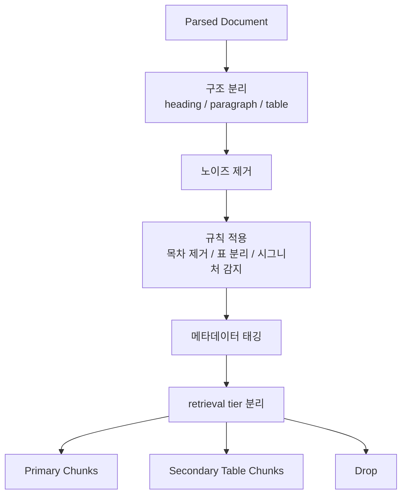

# 03. 하이브리드 청킹

## 1. 이 청킹을 뭐라고 불러야 하나

이 가이드에서 다루는 방식은 단순 semantic chunking이 아니다.
더 정확한 표현은:

- **구조화 문서 기반 하이브리드 청킹**
- **layout-aware rule-based chunking with domain metadata**
- **문서 구조 + 규칙 기반 + 도메인 태깅 청킹**

---

## 2. 왜 semantic chunking만으로 부족한가

semantic chunking은 의미 흐름을 보고 나누는 데 강하다.
하지만 실제 도메인 문서는 다음 문제가 있다.

- 표가 본문보다 검색 점수가 높아질 수 있다.
- heading/section 경계가 깨질 수 있다.
- 목차/조견표/도표가 일반 본문과 섞일 수 있다.
- 사례 명식 블록처럼 구조적 패턴이 중요한 텍스트를 놓칠 수 있다.

즉 실제 RAG에서는 의미만이 아니라 **문서 구조와 도메인 패턴**이 중요하다.

---

## 3. 하이브리드 청킹의 구성요소

### 3.1 구조 기반 분할
- heading을 기준으로 section 경계 인식
- table은 독립 chunk로 분리
- paragraph/list는 section 내에서 병합

### 3.2 규칙 기반 후처리
- header/footer 제거
- 판권/ISBN/목차/그림목록 제거
- 표/조견표 분리
- 저가치 chunk 제외

### 3.3 도메인 보강
- 명식 시그니처 감지
- topic 태깅
- doc_type 분류
- embedding 추천 여부 표시

---

## 4. 예시 메타데이터

```json
{
  "chunk_id": "elite_saju_kimdaeyoung:00073",
  "doc_id": "elite_saju_kimdaeyoung",
  "title": "왜 엘리트들은 사주를 보는가 (김대영)",
  "section_title": "# 십성",
  "doc_type": "case",
  "topics": ["십신", "재물", "연애결혼"],
  "is_myeongsik_chunk": false,
  "embedding_recommended": true,
  "page_start": 73,
  "page_end": 75,
  "text": "..."
}
```

---

## 5. 명식 시그니처 감지

전문 도메인에서는 일반 NLP chunking만으로는 부족하다.
예를 들어 사주 문서는 아래 같은 패턴이 의미 단위다.

- `시 일 월 년`
- `천간 지지`
- `비견 겁재 식신 상관 ...`
- 천간/지지 반복 패턴

이런 건 일반 문장 단위가 아니라 **도메인 구조 단위**다.

---

## 6. chunk tier 분리

하이브리드 청킹의 핵심은 chunk를 하나의 통으로 보지 않는 것이다.

### primary
- 본문 설명
- 사례 해설
- 운 해석
- 핵심 도메인 텍스트

### secondary
- 표
- 조견표
- 참조용 structured data

### drop
- 저가치 도입부
- 반복 목차
- noise

이 분리 덕분에:
- 메인 검색은 primary에서 하고
- 필요할 때만 secondary를 보조로 쓸 수 있다.

---

## 7. Mermaid: 청킹 설계 흐름



---

## 8. 설명 문구 예시

> 본 파이프라인은 Upstage Document Parse로 추출한 구조화 문서를 기반으로, 본문/표/사례를 분리하고 도메인 메타데이터를 부착한 하이브리드 청킹 방식이다.

이 문장은 기술 문서, 발표자료, README 어디에 넣어도 무난하다.
