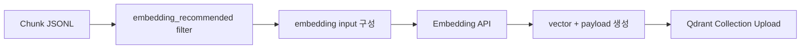

# 04. 임베딩과 인덱싱

## 1. 기본 원칙

검색 품질을 높이려면 단순히 chunk 본문만 임베딩하면 부족할 때가 많다.
보통은 다음을 합쳐서 임베딩 입력을 만든다.

- 문서 제목
- 섹션 제목
- 도메인 토픽 태그
- 본문 텍스트
- 필요하면 보조 semantic summary

---

## 2. 왜 제목/토픽을 같이 넣는가

예를 들어 본문에는 `정재`만 있고, 질문은 `정재격`이라고 들어올 수 있다.
이때 `section_title`, `topics`를 함께 임베딩에 넣으면 dense retrieval이 더 잘 잡힌다.

즉 임베딩 입력은 **원문 복사본**이 아니라 **검색 친화적 표현**이어야 한다.

---

## 3. 예시 임베딩 입력

```text
[title] 왜 엘리트들은 사주를 보는가 (김대영)
[section] # 상관(傷官)
[doc_type] theory
[topics] 십신, 직업, 재물
[text] 상관은 ...
```

---

## 4. 문서와 질문은 같은 계열 임베딩을 써야 한다

기본 구조:
- 문서 청크 → embedding model A
- 사용자 질문 → 같은 embedding model A
- 둘의 벡터 유사도 비교

질문을 임베딩하지 않고 keyword만 쓰는 구조는 dense retrieval이 아니다.

---

## 5. vector DB에 저장할 payload

payload에는 최소한 아래가 있어야 한다.

- `chunk_id`
- `doc_id`
- `title`
- `section_title`
- `doc_type`
- `topics`
- `page_start`, `page_end`
- `source_file`
- `is_myeongsik_chunk`
- `embedding_recommended`
- `text`

---

## 6. 컬렉션 운영 전략

### 나쁜 방식
- 기존 컬렉션 삭제
- 새로 업로드
- 문제가 생기면 복구 불가

### 좋은 방식
- `v1` 유지
- `v2` 새로 구축
- 평가 후 전환
- 충분히 안정되면 옛 컬렉션 정리

즉 정답은 **삭제 후 재업로드**가 아니라 **병렬 구축 후 컷오버**다.

---

## 7. 컬렉션 예시

- `saju_v1` — 기존 raw 중심 컬렉션
- `saju_v2_curated` — 정제된 혼합 컬렉션
- `saju_v3_primary_core` — 본문 중심 실전 컬렉션
- `saju_v3_secondary_table` — 표 보조 컬렉션(선택)

---

## 8. Mermaid: 인덱싱 흐름


