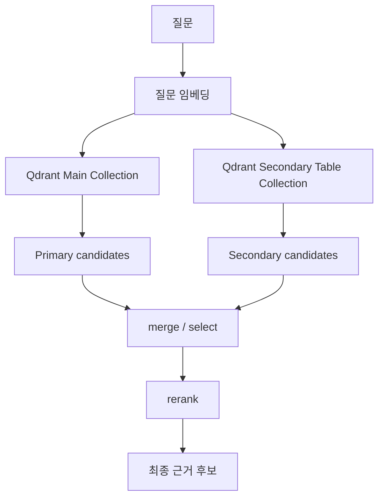

# 05. Qdrant Retrieval

## 1. Dense Retrieval의 역할

Qdrant 같은 vector DB는 질문과 문서를 같은 벡터 공간에 올려두고 유사한 chunk를 찾는다.

기본 흐름:
1. 질문 임베딩
2. Qdrant dense search
3. topN 후보 반환
4. rerank

---

## 2. dense retrieval만으로는 부족한 이유

vector search는 잘 동작해도 다음 문제가 생긴다.

- 의미는 비슷하지만 질문 의도와 안 맞는 chunk가 뜬다.
- 표 chunk가 키워드 밀집 때문에 상위권을 차지한다.
- 도메인 exact match가 약하다.
- source 다양성이 떨어진다.

그래서 dense retrieval은 **후보 생성 단계**로 보고, 그 뒤에 rerank가 들어간다.

---

## 3. payload filtering의 중요성

Qdrant는 payload filter를 지원한다.
이 기능이 중요한 이유는 다음과 같다.

- 특정 source만 대상으로 검색 가능
- 특정 doc_type만 허용 가능
- 특정 topic 버킷만 대상으로 검색 가능
- primary / secondary tier를 분리할 수 있음

즉 vector similarity 위에 **구조적 제약**을 올릴 수 있다.

---

## 4. collection 분리 전략

### 단일 컬렉션
장점:
- 단순함
- 구현 빠름

단점:
- table dominance 발생
- 본문과 참조용 구조 데이터가 섞임
- rerank가 복잡해짐

### 다중 컬렉션
장점:
- 본문 중심 메인 검색 가능
- 표는 보조 검색으로 분리 가능
- 운영 전환과 A/B 테스트가 쉬움

단점:
- 관리 복잡도 증가

---

## 5. 실제 운영 추천

### 메인 컬렉션
- `primary_core`
- 설명형 본문, 사례, 운 해석 중심

### 보조 컬렉션
- `secondary_table`
- 표, 조견표, 참조형 chunk

질문이 약하거나 exact data가 필요할 때만 secondary를 붙인다.

---

## 6. 검색 품질을 높이는 팁

- topN은 너무 작지 않게 잡는다.
- 하지만 최종 topK는 좁게 유지한다.
- retrieval과 rerank를 분리해 로그를 남긴다.
- collection 이름에 버전을 붙인다.
- source/title 중복 페널티를 검토한다.

---

## 7. Mermaid: retrieval 전략

