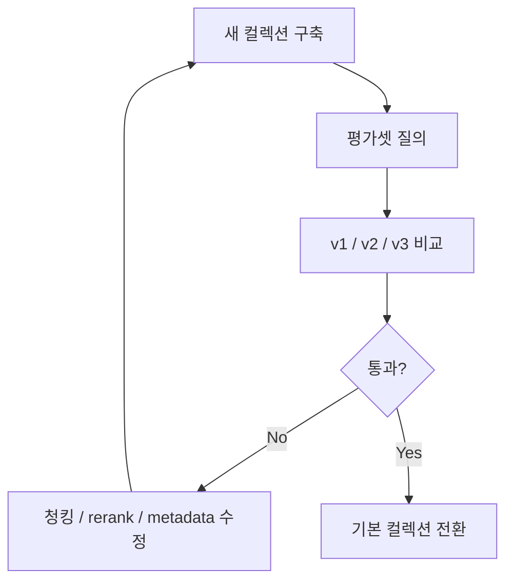

# 07. 평가와 디버깅

## 1. 왜 평가셋이 필요한가

RAG는 개선 작업을 할수록 ‘조금 나아진 것 같음’에 속기 쉽다.
그래서 평가셋이 필요하다.

평가셋이 없으면:
- 검색 품질이 실제로 좋아졌는지 모름
- 회귀(regression)를 잡지 못함
- 운영 전환이 위험함

---

## 2. 최소 평가셋 구성

질문 20~50개 정도만 있어도 좋다.

예시:
- `丙일간 酉월 정재격`
- `辰辰 자형`
- `壬丙충`
- `화개살 역마살`
- `辛丑 대운 정재 상관`
- `직업 적성 상관 정재`

각 질문마다 적어두면 좋은 것:
- 기대 source
- 기대 topic
- 기대 doc_type
- 기대 핵심 문장

---

## 3. 어떤 지표를 볼까

### retrieval 지표
- top1 적중률
- top3 적중률
- exact key 포함률
- source 다양성
- table dominance 비율

### answer 지표
- 직접 근거 수
- 0건 명시 정확성
- 일반론 반복률
- 도메인 레이어 누락 여부

---

## 4. 흔한 디버깅 포인트

### 4.1 표가 너무 많이 뜬다
원인:
- table chunk가 lexical hit가 강함
해결:
- 컬렉션 분리
- table penalty
- primary_core 우선

### 4.2 결과가 텅 빈다
원인:
- payload field mismatch
- qdrant env mismatch
- content/text 필드 혼선

### 4.3 리랭커가 죽는다
원인:
- UUID id를 int로 변환
- payload schema 불일치

### 4.4 의미는 비슷한데 질문 의도와 안 맞는다
원인:
- query encoding 부족
- 버킷 검색 미적용

---

## 5. 비교 운영 전략

좋은 실험 방식:
- v1 유지
- v2 새로 구축
- v3 core-primary 새로 구축
- 같은 쿼리로 비교
- 평가 후 기본 컬렉션 전환

이런 방식이면 실패해도 복구가 쉽다.

---

## 6. Mermaid: 평가 루프

---

## 7. 운영자 체크리스트

- [ ] 청킹 수량이 적절한가
- [ ] 추천 청크 비율이 적절한가
- [ ] table/non-table 분리가 필요한가
- [ ] 질문 임베딩과 문서 임베딩 모델이 같은가
- [ ] qdrant env가 올바른가
- [ ] rerank에 metadata가 반영되는가
- [ ] direct evidence 0건 처리 로직이 있는가
