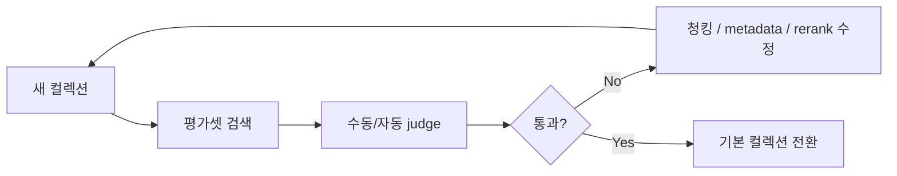

# 12. 연구 플레이북 — 질문 전략과 검증 방법

## 1. 왜 이 문서가 필요한가

RAG는 문서를 잘 넣는 것만으로 끝나지 않는다.
실제로는 아래 2개가 꼭 필요하다.

1. **질문을 어떻게 검색 친화적으로 바꿀 것인가**
2. **좋아졌는지 어떻게 검증할 것인가**

---

## 2. 질문 인코딩 템플릿

### 목적
사용자 질문을 그대로 벡터 검색에 넣기 전에, retrieval 친화적 구조로 바꾼다.

### 예시 템플릿
```text
사용자 질문을 검색용 버킷으로 재구성하라.

출력 형식:
- intent:
- entities:
- buckets:
- rewritten_queries:

조건:
- 질문 의도를 1~2개로 요약
- 도메인 엔티티를 추출
- 필요한 경우 격국 / 관계 / 신살 / 운세 / 직업 / 재물 같은 버킷으로 분리
- 각 버킷마다 검색용 rewrite query를 1개 이상 생성
```

---

## 3. retrieval 이후 answer assembly 템플릿

```text
아래 evidence를 바탕으로 답변하라.

규칙:
1. direct evidence와 near evidence를 구분할 것
2. evidence가 약하면 0건 또는 근접 근거임을 명시할 것
3. 일반론 반복 금지
4. 질문 의도와 직접 관련된 결론만 제시할 것
5. 필요하면 실행 액션까지 제안할 것

출력 형식:
- 질문 요약
- 근거
- 구조 지표
- 해석
- 결론
- 리스크 / 액션
- 신뢰도
```

---

## 4. CRAG-style 재검색 프롬프트 템플릿

```text
현재 검색 결과는 부족하다.

부족한 이유:
- source 반복 / direct evidence 부족 / table dominance / exact key mismatch 중 무엇인지 요약

해야 할 일:
1. query rewrite 수행
2. 필요 시 source 또는 bucket 제한
3. primary/core 컬렉션 우선
4. 그래도 부족하면 near evidence 기반으로 전환하고 0건 명시
```

---

## 5. 평가용 judge 프롬프트 템플릿

```text
질문, 검색 결과, 최종 답변을 보고 아래를 평가하라.

평가 항목:
- 질문 의도 반영 여부
- direct evidence 존재 여부
- 일반론 반복 여부
- 도메인 레이어 누락 여부
- 답변의 실행 가능성

출력 형식:
- score_5
- strengths
- weaknesses
- regression_signals
```

---

## 6. 검증 체크리스트

### retrieval 검증
- [ ] top1이 질문 의도와 맞는가
- [ ] top3 안에 읽을 수 있는 본문 evidence가 있는가
- [ ] 표가 상위권을 점령하지 않는가
- [ ] source 다양성이 있는가
- [ ] exact key가 반영되는가

### answer 검증
- [ ] direct evidence / near evidence가 구분되는가
- [ ] 0건이면 0건이라고 말하는가
- [ ] 일반론 반복이 없는가
- [ ] 질문 범위를 넘지 않는가

---

## 7. 릴리즈 전 점검 루틴



---

## 8. 연구 정리 포인트

이 플레이북을 통해 정리할 수 있는 핵심은 다음과 같다.

> 이 시스템은 단순한 벡터 검색이 아니라, query encoding과 answer assembly까지 포함한 하네스 관점으로 설계되었다. 또한 검색 품질은 평가셋과 rerank 로그를 통해 검증 가능한 구조로 운영된다.
