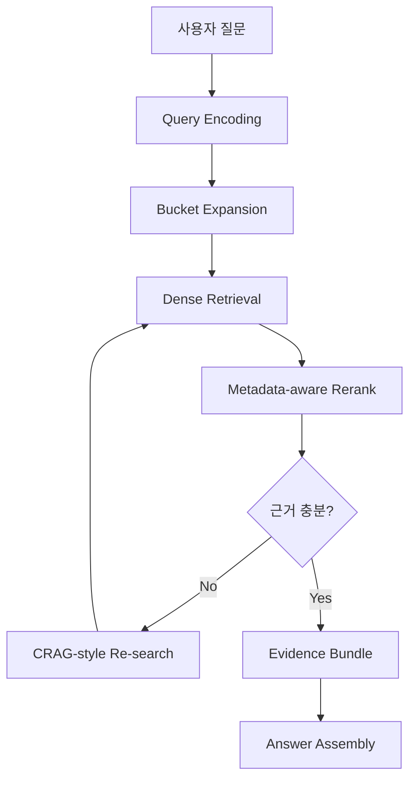

# 13. Harness Engineering

## 1. 왜 하네스가 필요한가

RAG에서 검색만 잘 된다고 끝이 아니다.
실제 시스템은 아래를 하나의 흐름으로 묶어야 한다.

- 질문 의도 분류
- 검색용 query 생성
- dense retrieval
- rerank
- 재검색(CRAG-style)
- 최종 evidence 조립
- 답변 포맷 정리

이 역할을 담당하는 것이 **하네스(harness)**다.

---

## 2. 이 프로젝트에서의 하네스 역할

이번 사례에서는 `saju` 도메인 하네스를 기준으로 다음을 구성했다.

### 핵심 스크립트
- `artifacts/harness/qdrant_saju_harness.py`
- `artifacts/retrieval/qdrant_rerank.py`
- `artifacts/harness/ten_god_profile.py`

### 하네스가 하는 일
1. 질문을 버킷으로 나눈다.
2. 각 버킷별로 query rewrite를 만든다.
3. Qdrant에 dense retrieval을 보낸다.
4. lexical + metadata-aware rerank를 적용한다.
5. 근거가 약하면 재검색한다.
6. evidence를 답변 포맷에 맞게 조립한다.

---

## 3. 단일 쿼리 대신 버킷형 검색을 쓴 이유

복합 도메인 질문은 한 줄 검색으로 잘 안 풀린다.
예를 들어 사주 도메인에서는 질문 하나에 여러 층위가 같이 들어간다.

- 격국
- 십신
- 합충형파해
- 신살
- 십이운성
- 대운/세운
- 직업/재물 같은 주제축

그래서 하네스는 이걸 버킷으로 나눠 검색했다.

### 장점
- 일반론 반복 감소
- 특정 구조 누락 방지
- evidence 다양성 증가
- 재검색 기준 설정 쉬움

---

## 4. 하네스 설계 포인트

### 4.1 query encoding
질문을 바로 검색에 던지지 않고, 검색 친화적인 형태로 재구성한다.

### 4.2 rerank와 하네스 분리
검색과 재정렬은 분리해두는 게 좋다.
그래야:
- 디버깅이 쉽고
- 품질 비교가 가능하고
- 점수 로직을 독립적으로 개선할 수 있다.

### 4.3 direct evidence / near evidence 구분
전문 도메인에서는 exact match가 항상 나오지 않는다.
그래서 하네스는:
- 직접 근거
- 근접 근거
- 0건
을 구분해 다루어야 한다.

---

## 5. 하네스 엔지니어링에서 실제로 손본 것

### UUID id 대응
기존 리랭커는 point id를 int로 가정했는데, 새 컬렉션에서는 UUID string을 쓰고 있었다.
이 때문에 reranker가 실패했다.
이를 수정해 string id를 정상 처리하도록 바꿨다.

### payload fallback
기존 검색 코드는 `content`만 읽는 경우가 있었는데, 새 컬렉션은 `text` 필드를 사용했다.
그래서 `content/text/title/section_title` fallback을 추가했다.

### metadata-aware scoring
다음 요소를 리랭크에 반영했다.
- topic bonus
- section bonus
- doc_type penalty
- table penalty
- 명식 시그니처 bonus

---

## 6. Mermaid: 하네스 내부 아키텍처

---

## 7. 왜 이게 중요한가

좋은 하네스는 단순히 검색 결과를 모아주는 코드가 아니다.
좋은 하네스는 **질문을 검색 가능한 형태로 변환하고, retrieval 결과를 도메인 답변으로 연결하는 엔진**이다.

즉 하네스 품질이 곧:
- evidence 품질
- 답변 신뢰도
- 운영 안정성
을 결정한다.
