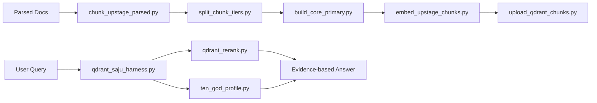

# 14. Code Walkthrough

## 1. 이 섹션의 목적

이 문서는 `artifacts/` 디렉토리에 포함된 실제 스크립트가 각각 어떤 역할을 하는지 설명한다.
그냥 코드만 올리는 대신,

- 이 파일이 왜 필요한지
- 어디서 호출되는지
- 어떤 문제를 해결했는지
- 남은 한계가 뭔지

를 같이 적어 엔지니어링 문서로 만든다.

---

## 2. 파일별 요약

### `artifacts/chunking/chunk_upstage_parsed.py`
역할:
- Upstage parser 결과(JSON)를 읽어서 구조 기반 청킹을 수행한다.

핵심 포인트:
- heading / paragraph / table 분리
- 노이즈 제거
- doc_type 분류
- topics / entities 추출
- `is_myeongsik_chunk`, `embedding_recommended` 생성

해결한 문제:
- parser 출력물을 바로 벡터DB에 넣었을 때 생기는 노이즈 문제
- 단순 semantic chunking으로는 놓치는 구조 단위 보존

---

### `artifacts/chunking/split_chunk_tiers.py`
역할:
- 청크를 primary / secondary(table) / drop으로 나눈다.

핵심 포인트:
- 검색용 주 컬렉션과 보조 컬렉션 분리 기반 제공
- table dominance 문제 대응

---

### `artifacts/chunking/build_core_primary.py`
역할:
- primary 중에서도 더 실전적인 core-primary만 남긴다.

핵심 포인트:
- 핵심 topic 중심 필터링
- 서문/교양성/저가치 본문 제거

해결한 문제:
- primary에도 남아 있던 잡음을 더 줄여 메인 검색 품질 향상

---

### `artifacts/embedding/embed_upstage_chunks.py`
역할:
- 청크를 Upstage `embedding-query`로 임베딩한다.

핵심 포인트:
- 제목 + 섹션 + topic + 본문을 조합한 embedding input 생성
- `embedding_recommended` 필터 사용
- 배치 처리

해결한 문제:
- 본문만 임베딩했을 때 semantic signal이 약한 경우 보완

---

### `artifacts/retrieval/upload_qdrant_chunks.py`
역할:
- 임베딩된 청크를 Qdrant 컬렉션에 업로드한다.

핵심 포인트:
- 컬렉션 생성
- vector size 자동 확인
- payload 포함 업로드
- UUID 기반 point id 생성

해결한 문제:
- integer id 가정에서 벗어나 안정적인 업로드 방식 확보

---

### `artifacts/retrieval/qdrant_rerank.py`
역할:
- dense retrieval 결과를 lexical + metadata-aware 방식으로 재정렬한다.

핵심 포인트:
- lexical score
- exact term bonus
- topic/section bonus
- table penalty
- payload fallback (`content`/`text`)
- UUID/string id 대응

해결한 문제:
- dense retrieval만으로는 일반론/표/중복이 상위에 뜨던 문제
- schema mismatch 및 id 형식 문제

---

### `artifacts/harness/qdrant_saju_harness.py`
역할:
- 도메인 질문을 버킷형 검색 흐름으로 풀어주는 하네스

핵심 포인트:
- 질문 의도에 따라 버킷형 query 생성
- `격국 / 관계 / 신살 / 운세` 등 버킷 분리
- `qdrant_rerank.py` 호출
- 결과 diversified top 구성

해결한 문제:
- 단일 쿼리 검색의 일반론 반복과 구조 누락 문제

---

### `artifacts/harness/ten_god_profile.py`
역할:
- 명식 구조를 수치화해 보조 해석 지표를 만든다.

핵심 포인트:
- 십신 family 분포 계산
- 대운/세운 개입 전후 비교
- 신약/신강 보조 판단

해결한 문제:
- 근거 문헌만으로 부족한 경우 구조 해석을 수치 지표로 보완

---

## 3. 코드 아키텍처 요약

---

## 4. 남은 개선 포인트

- secondary table 컬렉션을 별도 운영할지 결정
- exact domain match를 더 강하게 반영하는 score 추가
- 자동 평가셋 실행 스크립트 연결
- harness 결과를 answer synthesis template과 더 긴밀하게 연결

---

## 5. 이 섹션을 어떻게 활용하면 좋은가

이 문서는 다음 상황에서 유용하다.

- 레포를 처음 보는 사람이 전체 구조를 이해할 때
- 코드 리뷰 시 왜 이런 스크립트가 필요한지 설명할 때
- 학습/연구 결과를 구조적으로 남길 때
- retrieval 파이프라인 개선 과정을 되짚어볼 때
